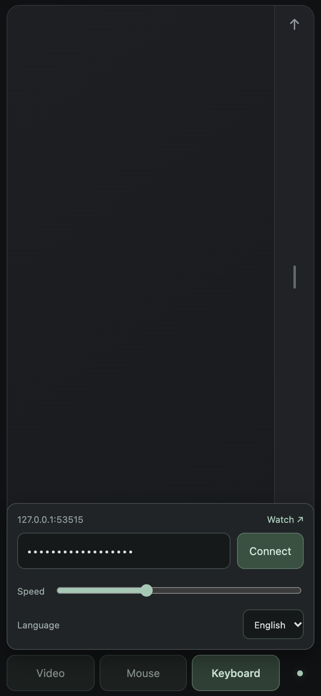

# WatchMouse

**Turn your phone into a wireless mouse and keyboard for Windows and macOS.**

[简体中文](README.zh-CN.md) · [Download](https://github.com/jiangyiyx-star/WatchMouse/releases/latest) · [Report an issue](https://github.com/jiangyiyx-star/WatchMouse/issues)


[](https://github.com/jiangyiyx-star/WatchMouse/actions/workflows/mac.yml)
[](https://github.com/jiangyiyx-star/WatchMouse/actions/workflows/windows.yml)

Open the desktop receiver, scan its QR code with your phone, and control the focused app over your local Wi-Fi. No phone app or account is required.

## Screenshots

Screenshots show the actual interface using demo data. The displayed demo QR code and key cannot pair with a real receiver.

| Phone trackpad | Phone keyboard | Language & connection |
| --- | --- | --- |
|  |  |  |

| macOS receiver | Windows receiver |
| --- | --- |
|  |  |

## Download and start

| Platform | Download | First start |
| --- | --- | --- |
| Windows | [WatchMouse-2.4.exe](https://github.com/jiangyiyx-star/WatchMouse/releases/download/v2.4/WatchMouse-2.4.exe) | Open the EXE. Allow its connection on your trusted private network if prompted. |
| Apple silicon Mac | [WatchMouse-Mac-2.4-arm64.zip](https://github.com/jiangyiyx-star/WatchMouse/releases/download/v2.4/WatchMouse-Mac-2.4-arm64.zip) | Unzip and move WatchMouse to Applications. Enable its Accessibility permission in System Settings. |

Desktop builds include Python and the web UI. You do not need to install Python to use them. The Mac download targets Apple silicon and macOS 11 or later; an Intel Mac build has not been validated. These builds are not commercially code-signed; the Mac app is ad-hoc signed and not Apple-notarized.

1. Connect your phone and computer to the same Wi-Fi.
2. Start WatchMouse and scan the QR code once in your phone's browser.
3. Focus the app you want to control on the computer.
4. Keep the receiver running. Closing its window stops the service.

**Pair once:** the desktop keeps its pairing key across restarts and upgrades; the phone saves it in the same browser and automatically reconnects when the receiver returns. Bookmark the paired URL for next time. Clearing browser storage or resetting the desktop configuration requires pairing again. If the computer's LAN address changes, scan its updated QR code; the pairing key itself stays the same. Browser storage is tied to the address, so automatic discovery across changed IP addresses is not supported.

## What it does

- **Mouse:** one-finger movement, tap to click, left/right buttons, drag toggle, two-finger scrolling, and a separate one-finger scroll strip.
- **Keyboard:** draft text on your phone and send it when ready. Supports Chinese, emoji, phone IME, and keyboard dictation. Text and input events go to the focused desktop app.
- **Video:** large previous, play/pause, and next buttons for apps that respond to arrow/space keys.
- **Language:** English by default, with saved Simplified Chinese selection on the phone and both desktop receivers.
- **Mac shortcuts:** protocol Ctrl/Win modifiers map to Command; Alt maps to Option.
- **Watch:** an experimental JavaScript-free `/watch` page. Physical Apple Watch compatibility has not been verified.

The website does not change your phone keyboard's dictation language or stream phone audio as a system microphone. Browser speech input is only offered where the browser supports it in a secure context. Some games and protected input fields may reject synthetic input or Unicode events.

## Local and private

There is no hosted WatchMouse account, relay, or analytics. A persistent random key protects input commands; keep the QR code and pairing link private. Traffic uses **unencrypted local HTTP**, so use a trusted network and never forward port 53514 to the Internet. See [Security](SECURITY.md) for the model and pairing reset steps.

## Build from source

### Windows

```powershell
cd Windows\Windows
py -3 -m pip install -r requirements-build.txt
py -3 app.py
powershell -NoProfile -ExecutionPolicy Bypass -File .\build.ps1
```

The build supports Windows PowerShell 5.1 and paths/usernames containing Chinese characters. [Windows development guide](Windows/Windows/README.md)

### macOS

```bash
python3 -m venv .venv
.venv/bin/python -m pip install -r Mac/requirements.txt
.venv/bin/python Mac/app.py
bash Mac/build.sh
```

[Mac development guide](Mac/README.md)

### Tests

```bash
python -m unittest discover -s Windows/Windows/tests
node Windows/Windows/tests/frontend-smoke.cjs
# On macOS with Mac dependencies installed:
python -m unittest discover -s Mac/tests
```

CI builds both platforms. Input tests mock final injection so they do not type into or move the tester's desktop. Real phone-to-Mac connection and control have been confirmed by a user; full app compatibility and physical Apple Watch behavior remain unverified.

## Project layout

```text
Mac/                    Native Cocoa receiver and Quartz adapter
Windows/Windows/        Windows receiver, shared HTTP service and phone UI
docs/screenshots/       Screenshots made with non-working demo pairing data
.github/workflows/      Platform tests, builds and demo screenshots
```

The phone assets remain in their original Windows directory so both existing builds can reuse the same protocol and UI.

## Contribute and license

Issues and focused pull requests are welcome. Read [Contributing](CONTRIBUTING.md) before sending a change.

WatchMouse source is licensed under [MIT](LICENSE). Bundled third-party components retain their own licenses; see [Third-party notices](THIRD_PARTY_NOTICES.md).
