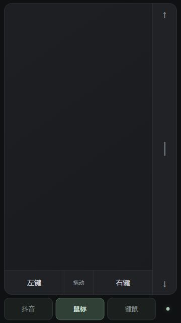
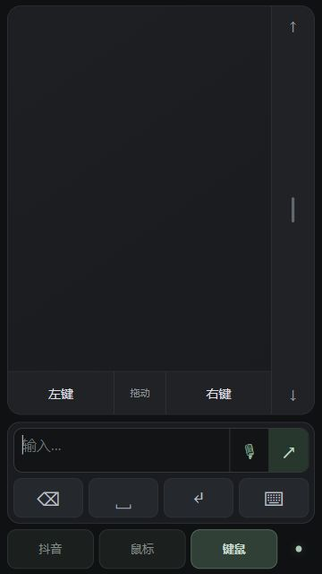

# 随手控 / WatchMouse

把手机变成 Windows 或 Mac 电脑的无线鼠标和键盘。手机与电脑连接同一 Wi-Fi，电脑打开应用，手机扫描二维码即可使用。

## 使用

1. 从 [v2.3 下载页](https://github.com/jiangyiyx-star/WatchMouse/releases/tag/v2.3) 下载 `WatchMouse-2.3.exe`。
2. 关闭旧版本，再双击新版。应用自动启动接收服务，无需安装 Python。
3. 手机扫描应用中的二维码，或刷新原来的遥控页面。
4. 在电脑上选中要操作的窗口，再使用手机控制。

初次连接如遇防火墙阻拦，点桌面应用中的“允许局域网连接”。更多说明见 [启动说明](启动说明.md)。

## Mac 版本

从 [v2.3 下载页](https://github.com/jiangyiyx-star/WatchMouse/releases/tag/v2.3) 下载 `WatchMouse-Mac-2.3-arm64.zip`（Apple 芯片 Mac）。解压并将 `WatchMouse.app` 移到应用程序，打开后在“系统设置 → 隐私与安全性 → 辅助功能”中授权，再用手机扫码。

Mac 版提供原生窗口、二维码、服务启停、中文输入和 Command 组合键。使用、首次启动与构建说明见 [Mac 开发说明](Mac/README.md)。实体手机和手表操作仍需实测。

## 三种模式

- **抖音**：大号上一个、播放/暂停、下一个按钮。
- **鼠标**：大触控板、左右键、拖动开关，右侧滚动带支持单指滑动。
- **键鼠**：触控板加紧凑输入区，使用手机自己的键盘和语音输入法；文字确认后发送到电脑。

横竖屏自动调整。连接入口是底部小圆点，鼠标速度也在连接设置中。手机键盘弹出时，触控区域按可用高度缩小。Apple Watch 提供 `/watch` 简版入口，真实手表兼容性待实测。

| 鼠标 | 键鼠 |
| --- | --- |
|  |  |

## 开发与构建

源码位于 [`Windows/Windows`](Windows/Windows)，详细运行和打包步骤见 [开发说明](Windows/Windows/README.md)。

```powershell
cd Windows\Windows
py -3 -m pip install -r requirements-build.txt
py -3 app.py
```

重新打包：

```powershell
powershell -NoProfile -ExecutionPolicy Bypass -File .\build.ps1
```

测试：

```powershell
py -3 -m unittest discover -s tests
node tests/frontend-smoke.cjs
```

EXE 通过 GitHub Releases 分发；Git 仓库保存源码、测试、说明和当前 UI 截图。
