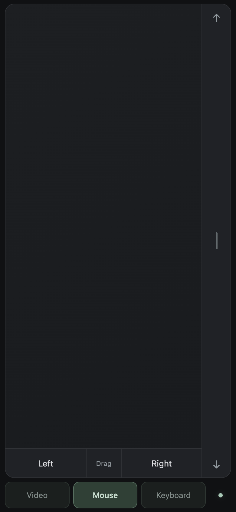
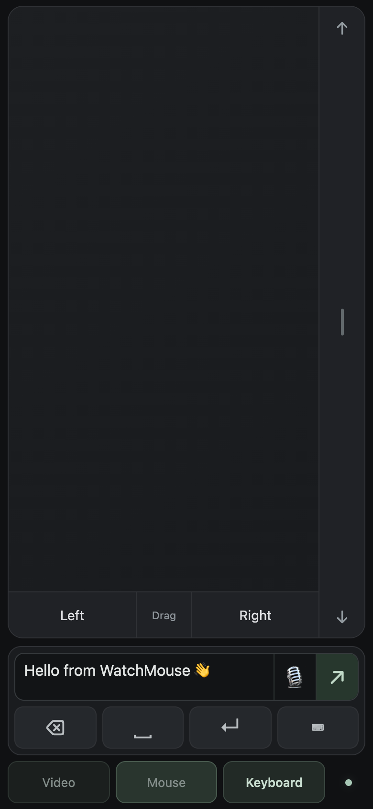
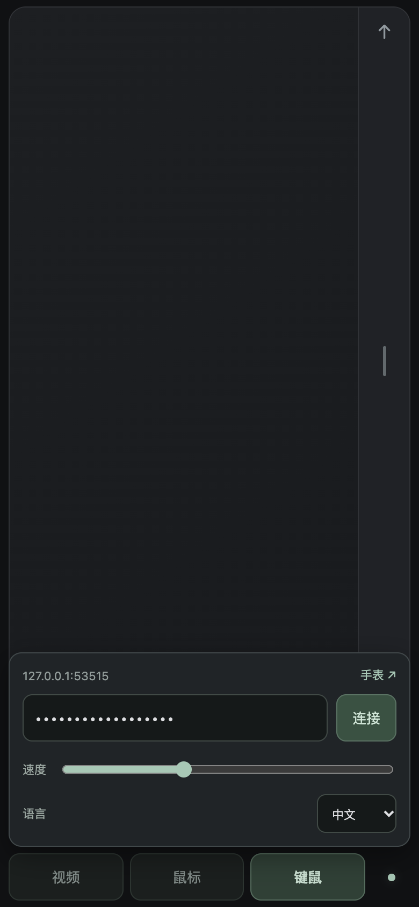
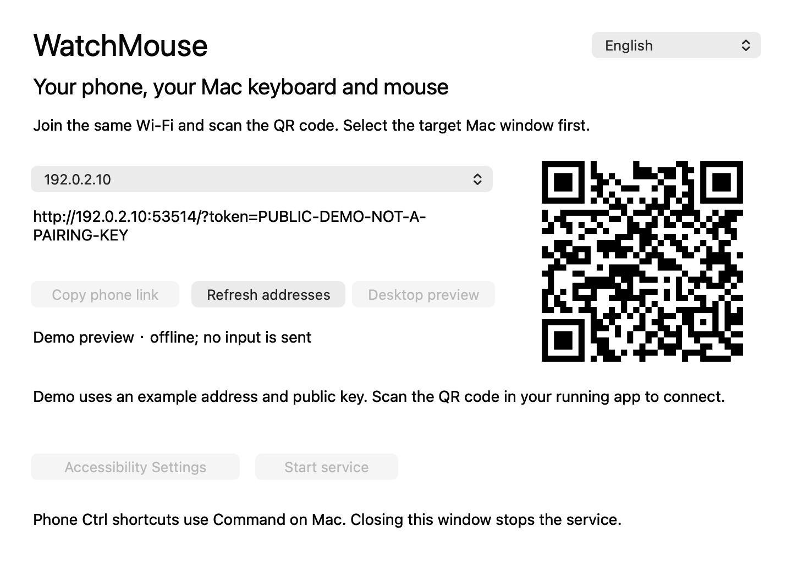
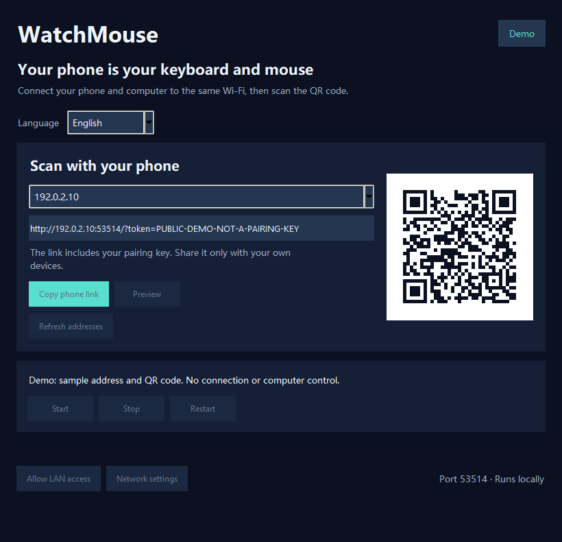

# 随手控 / WatchMouse

**把手机变成 Windows 和 Mac 的无线鼠标与键盘。**

[English](README.md) · [下载最新版](https://github.com/jiangyiyx-star/WatchMouse/releases/latest) · [反馈问题](https://github.com/jiangyiyx-star/WatchMouse/issues)

电脑打开接收器，手机连同一个 Wi-Fi，扫码即可控制当前选中的窗口。无需手机 App、账号或云端中转。

## 界面截图

以下是实际界面的演示截图，使用独立演示数据；截图中的二维码和配对码不能连接真实接收器。

| 手机鼠标 | 手机键盘 | 中文及连接设置 |
| --- | --- | --- |
|  |  |  |

| Mac 接收器 | Windows 接收器 |
| --- | --- |
|  |  |

## 下载与使用

- Windows：[WatchMouse-2.4.exe](https://github.com/jiangyiyx-star/WatchMouse/releases/download/v2.4/WatchMouse-2.4.exe)。双击启动，首次连接按提示允许专用网络访问。
- Apple 芯片 Mac：[WatchMouse-Mac-2.4-arm64.zip](https://github.com/jiangyiyx-star/WatchMouse/releases/download/v2.4/WatchMouse-Mac-2.4-arm64.zip)。解压后放进“应用程序”，在系统设置中启用 WatchMouse 的辅助功能权限。

安装包自带运行环境，不用安装 Python。Mac 下载包支持 macOS 11 及以上，Intel 包尚未验证。Mac 为自签名构建，尚未经过 Apple 公证；首次启动若被阻止，需在隐私与安全设置中确认来源后选择“仍要打开”。

1. 手机与电脑连同一个 Wi-Fi。
2. 启动电脑接收器，用手机浏览器扫描二维码。
3. 在电脑上选中要操作的窗口。
4. 保持接收器运行，关闭窗口会停止服务。

**只需首次配对：**电脑会保存配对密钥，重启、更新时不会主动重置；手机浏览器也会保存，接收器重新启动后自动重连。建议收藏扫码后的完整链接。清除浏览器数据或重置电脑配置后需要重新配对；电脑局域网 IP 改变时要扫描更新后的地址，密钥本身不用重设。浏览器存储按地址隔离，暂不支持跨 IP 自动发现。

## 功能

- **鼠标**：单指移动、轻点单击、左右键、拖动开关、双指滚动和独立单指滚动带。
- **键鼠**：用手机输入法编辑草稿，确认后发送到电脑，支持中文、emoji、粘贴和输入法语音转文字。
- **视频**：上一个、播放/暂停、下一个大按钮，适用于支持方向键/空格键的应用。
- **语言**：手机、Mac 和 Windows 界面默认英文，可选择简体中文并保存选择。
- **Mac 快捷键**：协议中的 Ctrl/Win 映射为 Command，Alt 映射为 Option。
- **手表**：提供不用 JavaScript 的 `/watch` 简版，实体 Apple Watch 兼容性尚未实测。

网页不会改变手机输入法的语音识别语言，也不提供手机音频作为系统麦克风的功能。浏览器语音识别仅在受支持的安全上下文出现。游戏、受保护输入框及部分自行处理键码的应用可能拒绝模拟输入。

## 本地连接与安全

项目没有云端账号、中转服务或统计上报。配对链接能控制电脑，请只分享给自己的设备。局域网连接使用**未加密 HTTP**，仅用于可信网络，不要把 53514 端口映射到公网。见 [安全说明](SECURITY.md)。

## 开发

[Windows 开发与构建](Windows/Windows/README.md) · [Mac 开发与构建](Mac/README.md) · [贡献指南](CONTRIBUTING.md)

Windows 构建脚本兼容 PowerShell 5.1，处理中文用户名和路径。GitHub Actions 分别测试并构建两平台。测试拦截最终系统输入，不会操作测试电脑的桌面。

用户已确认真实手机可以连接并控制 Mac；所有目标应用及实体 Apple Watch 的完整兼容性仍需实测。

项目源代码使用 [MIT 协议](LICENSE)，第三方组件保留各自许可，见 [第三方许可说明](THIRD_PARTY_NOTICES.md)。
